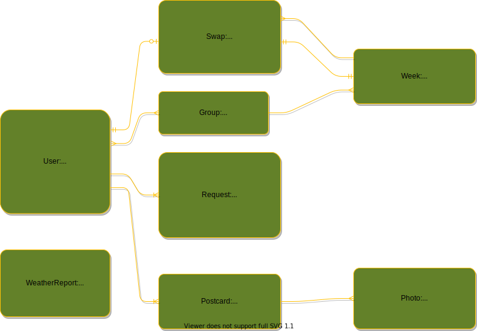

# Little Cabin

> Securely share your family's get-away and memories.

Secure, family-only web application providing:

- shared group calendar with permissions-based week swapping and selling
- micro-social media network offering "postcards" which a short message with a personal photo or suggested image
- requests list collecting suggestions from members on maintenance items, purchase ideas, or other helpful suggestions. Other members can upvote the requests by giving an "agree"
- static pages with important information including legal trust information, weekly chores, dues schedule, contact info for local businesses and emergency situations

## Pages

> Home page (not logged in) will display info mainly about Little Cabin the app. All other pages are only available if logged in, and will display information about the actual family and property

### Account

- Home (open)
- Login (open)
- Signup (open)
- App Info (open)
  - Emergency Info
  - Weekly Chores
  - Local Business Recommendations
  - Property History
  - Family Tree
  - Legal Trust Info

### Options

- Calendar
- Postcards
- Requests
- Camp Info / Family History

### Report A Bug

- Email Admin

# Problems Solved

- integrating an existing design into an extensible Django base template
- fixing deployment issues with DEBUG config vars
- integrating css variables (custom properties) with existing design to make future changes as simple as possible
- extending Django's `UserCreationForm`; requiring `first_name`, `last_name`, and `email`, and removing the field for `username`; actually presented `username` as **Email** to user for all account related services (Register, Login, etc), since all the solutions recommended creating a custom user model _before starting the project_..... too late.
- custom pagination (view one year at a time). sending value out from form btn into the views. saving fetched data in big chunk into db, and reading from there unless data is stale then refetching
- [Extending UserCreationForm](https://dev.to/yahaya_hk/usercreation-form-with-multiple-fields-in-django-ek9)
  https://developers.google.com/calendar/quickstart/python
  https://github.com/googleworkspace/python-samples/issues/134
  https://stackoverflow.com/questions/63956706/google-drive-api-quickstart-py-error-400-redirect-uri-mismatch
  need to add credentials file, and need to gitignore it
  need to run Google's Python "quickstart" commands INSIDE the env
  - Couldn't chain capitalize() onto first letter, so used template filter `

## ERD (Entity Relationship Diagram)

## Tech

Fullstack Python App with Django

## Resources

- [Koka](https://angrystudio.com/themes/koka-free-bootstrap-5-website-template/)
- [Font Awesome Icons](https://fontawesome.com/)
- [Route Back To Section IDs](https://engineertodeveloper.com/a-better-way-to-route-back-to-a-section-ids-in-django/)
- [Extending UserCreationForm](https://dev.to/yahaya_hk/usercreation-form-with-multiple-fields-in-django-ek9)
  https://developers.google.com/calendar/quickstart/python
  https://github.com/googleworkspace/python-samples/issues/134
  https://stackoverflow.com/questions/63956706/google-drive-api-quickstart-py-error-400-redirect-uri-mismatch
  need to add credentials file, and need to gitignore it
  need to run Google's Python "quickstart" commands INSIDE the env
